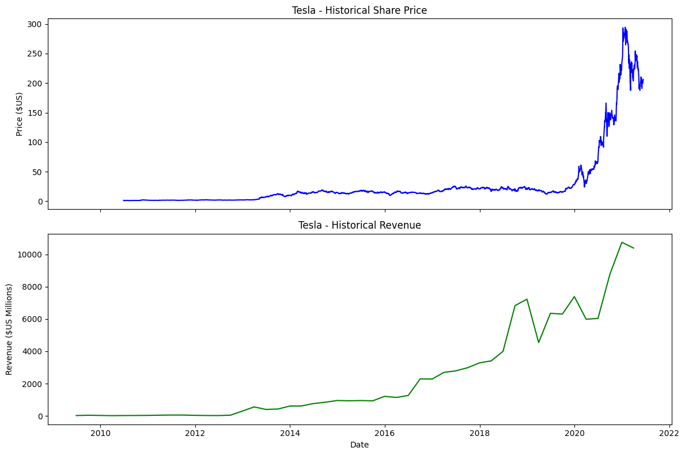
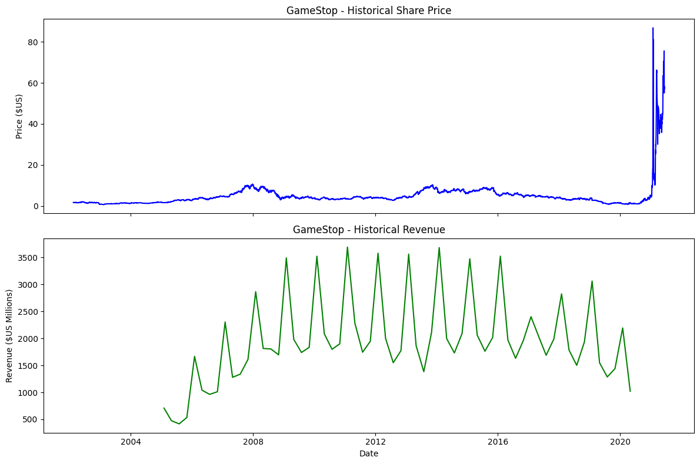

# Stock and Revenue Data Dashboard

## Project Overview
This project focuses on extracting essential financial data and visualizing it to assist in data-driven decision-making. Specifically, it analyzes the relationship between historical stock prices and annual revenue for **Tesla** and **GameStop**.

This work was completed as part of the **IBM Data Science Professional Certificate** curriculum.

## Features
- **Automated Data Extraction:** Uses the `yfinance` library to retrieve stock market data.
- **Web Scraping:** Employs `BeautifulSoup` to parse HTML and extract historical revenue tables from web sources.
- **Data Visualization:** An interactive dashboard built with `Plotly` that displays both Share Price and Revenue on a synchronized timeline.

## Visualizations
The following graphs illustrate the stock price trends compared to company revenue:

| Tesla Analysis | GameStop Analysis |
| :---: | :---: |
|  |  |

## Project Structure
* `Final Assignment Webscraping.ipynb`: The main notebook containing the final analysis and the `make_graph` function.
* `Revenue Data and Building a Dashboard-v1.ipynb`: Step-by-step breakdown of the dashboard construction.
* `WebScraping_Review_Lab.ipynb`: Preliminary lab focused on HTML parsing techniques.

## Installation
To run this project, you will need the following Python libraries:

```bash
pip install yfinance pandas requests beautifulsoup4 plotly
